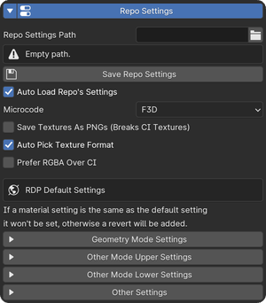

Repo Settings
=============

Repo settings can be used to save common settings in fast64, each gamemode can support extra settings.

.. note:: Currently only supported by SM64

| Supported game modes will attempt to load fast64.json from the repository folder if auto load is enabled in the file.
| Game mode specific settings can be found in the respective tabs.
| General fast64 settings and save/load operators can be found in the **Fast64** tab in the **Fast64 Global Settings**

If you want to stop a value from being set on loading the settings, you can remove it from the json.