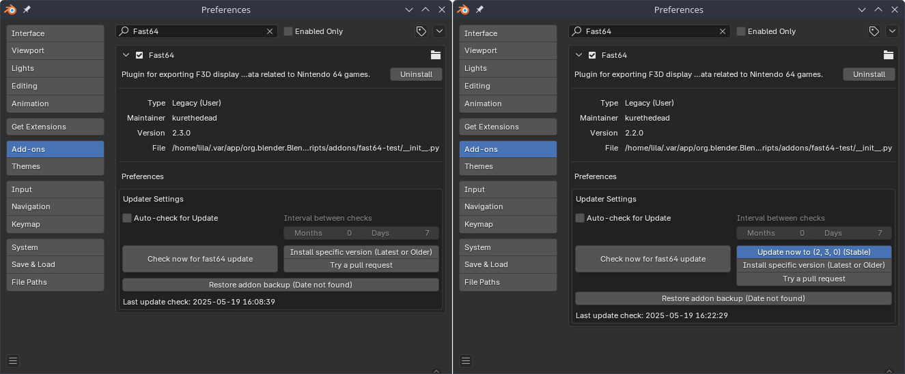

Updater
=======

| Fast64 uses `CGCookie/blender-addon-updater`_ as its updater.
| It can be found in the addon preferences (where Fast64 was installed) by searching for "Fast64".
| Click the "Check now for fast64 update" button to check for updates.

| You may get an extra option to update to a "Stable" version,  these are (ideally major-bug free) releases of Fast64
  contrary to "Main" which is where development is happening. 
| If there isn't you can still update to "Main" (for the latest bug fixes or features already approved), 
  an older version or an in develpoment pull request (feature or bug fix specific versions).

- To install a stable release (if available), click the "Update now to (Version) (Stable)" button.

- To install latest, click the "Install specific version (Latest or Older)" button, select main and click ok.
- To install an older version, click the "Install specific version (Latest or Older)" button, select your desired version and click ok.

.. image:: selecting_a_version.png
    :alt: Updater preferences after clicking the "Install specific version (Latest or Older)" button.

- To install a pull request, click the "Try a pull request" button, 
  select your desired active pull request and click ok. 
  You can read and comment about this pull request on GitHub, testing from users is always welcome.

| After updating, there should be a message with the text "Addon successfully installed" and 
  a red button to restart Blender named "Restart Blender to complete update".
| Clicking the red button will close Blender. 
| This is **necessary** for changes to apply.

| After restarting, Fast64 will be in your desired version, though some versions and pull requests may have an outdated updater.

| If the updater failed, there may be permission issues, try to download your desired version from GitHub instead.
| To do this, find your pull request in the Fast64 repository on GitHub.
| Click the link after the text "Author wants to merge x commits into [Fast-64:x] from", this points to the contributor's 
  branch page in which you can download the zip file like you would normally.
| Make sure to uninstall your existing Fast64 install first.

.. _CGCookie/blender-addon-updater: https://github.com/CGCookie/blender-addon-updater