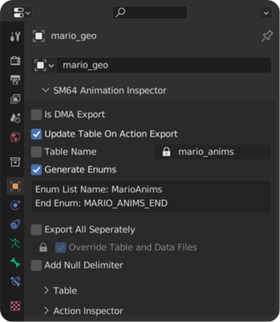
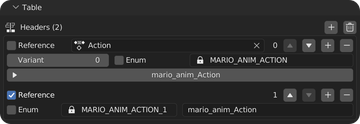
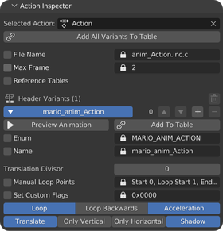
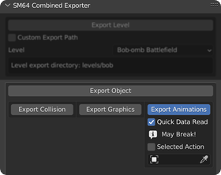
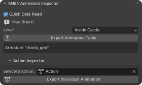
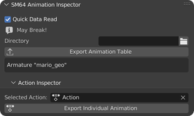

Creating Animations
===================

Animation Object
----------------
To export an animation, you will need a rig with animation bones (*"Animated Part (0x13)"* or *"Custom Animated"*) 
or a mesh with the *"Geolayout Command"* set to *"Animated Part (0x13)"*

In armatures, the bones will follow the same order as their geolayout counterpart. 
Switch bones are ignored so make sure your default option is the one with all the bones!

Adding An Action
----------------
To add an action to your object, select it and use the *"Add Basic Action"* button 
in the *"Action Inspector"* sub-panel of *"SM64 Animation Inspector"*.
This will automatically stash your action in the NLA tracks of the selected object.

-----------------------------------------------------------------------------

Animation Object Properties
---------------------------

The animation object's properties are shown in object properties in the *"SM64 Animation Inspector"* panel.

| You can find the elements of the table in the *"Table"* sub-panel. See `Table Element`_
| And you can inspect action properties in the *"Action Inspector"* sub-panel (Also found under the scene panel equivelent). See `Action Properties`_

**"Is DMA Export"**:

Is this animation object's table and actions exported in DMA table format (Like Mario).

**"Update Table"**: (Only available with *"Is DMA Export"* disabled in the animation object and *"Export Single Action"*)

In C exports, creates and updates the table along with includes.
In Binary, updates the table pointer at the index of the exported variants.

**"Table Name"**: (C. Only available outside DMA)

The name of the exported table.

**"Generate Enums"**: (C. Only available outside DMA)

| Enable to generate the enums for the variants, 
  they will be named after the variant name and can be used within actor scripts and functions.
  Example: ``cur_obj_init_animation(MARIO_ANIM_ACTION);``
| Custom names for the enum list and end enum are not supported.

| With *"Designated Initialization"*, tables will use the enum as the index directly using designated initialization.
  For example ``[MARIO_ANIM_ACTION] = mario_anim_action;``. 
| This feature is not supported in older C compilers like IDO, 
  without it enums will still be generated but can desync by user mistakes.

**"Export All Separately"**: (C. Only available outside DMA. Only applicable with *"Export Single Action"* disabled)

Export each animation (data and variants) in a Separete file. Reduces compression.

**"Override Table and Data Files"**: (C. Only available outside DMA. Only applicable with *"Export Single Action"* disabled. Forced if *"Export All Separately"* is disabled)

Override the table and data files that are exported instead of appending new includes and table elements.

**"Add NULL Delimiter"**: (Only available outside DMA. Only applicable in binary with *"Export Single Action"* disabled)

Add a ``NULL (0x00)`` delimiter to the end of the table.

**"Beginning Animation"**: (C and binary. Only available outside DMA, only available with *"Export Behavior"* enabled in C or *"Update Behavior"* in Binary)

The animation used in the ANIMATE command of the behavior script.

**"Table Start/End Address"**: (Binary)

Where the table will export to, outside DMA it will be used for updating table pointers if *"Update Table"* is enabled.

**"Update Behavior"**: (Binary. Only available outside DMA)

| Update the behavior script ``ANIMATE`` command with *"Beginning Animation"* and the ``LOAD_ANIMATIONS`` command with the table address.
| Will not error if the ``ANIMATE`` command is not found, check the console if you want to know if it was found.
| The behavior script can be found under this toggle as *"Behavior"*, 
  select ``Custom`` to set a specific address, otherwise use the search button.

**"Write Data Separately"**: (Binary. Only available outside DMA)

Write the animation data to a Separete address range (*"Data Start/End Address"*) instead of after the animation table.

**"File Name"**: (Insertable Binary)

The file name for the exported animation table.

-------------------------------------------------------------------------------------------------------------------------

Table Element
-------------
A table element points to an animation and one of its variants.

**"Action"**:

The animation that owns the variant.

**"Variant"**:

The number of the variant, 0 is the main variant.

**"Enum"**: (C. Only available outside DMA with *"Generate Enums"* enabled in the animation object)

The enum that will represent the animation index.

**"Reference"**: (Only available outside DMA)

C name or address of an animation variant (header)

-------------------------------------------------------------

Action Properties
-----------------

**"File Name"**: (C and Insertable Binary. Only applicable with *"Export All Separately"* enabled in the animation object or with *"Export Single Action"*)

The file name of the exported animation.

**"Max Frame"**:

The amount of frames to export. Separete from the loop points of the variants.

**"Reference Tables"**: (Only applicable outside DMA) 

Pass in references to existing animation data.

**"Start/End Address"**: (Binary. Only available with *"Export Single Action"*) 

The start and end address where the animation will be exported to.

--------------------------------------------------------------------

Header Variants
---------------
Each variant represents a way to playback the animation data.
You can add the variant to the animation object's table by pressing *"Add To Table"*.
Use the *"Preview Animation"* button to preview the animation, sets FPS to 30 and emulates loop points.

**"Table Index"**: (Only available for *"Export All Separately"* for DMA or Binary if *"Update Table"* is on)

| The index in the animation table.
| In binary (non DMA) is used to update the pointer at that index in the table.
| In binary (DMA) is used to know what header to substitute on re-export.

**"Enum"**: (C. Only available outside DMA with *"Generate Enums"* enabled in the animation object)
The enum that will represent the animation index.

**"Name"**: (C. Only available outside DMA)

The name of the animation variant that will be exported.

**"Translation Divisor"**:

If set to 0, the translation multiplier will be 1.
Otherwise, the translation multiplier is determined by dividing the object's 
translation dividend (animYTrans) by this divisor.

**"Manual Loop Points"**:

When enabled, you can manually set the loop points.

- *"Start"*: The starting frame of the animation, not the same as loop start.
- *"Loop Start"*: If *Backwards* is not set, this will be the starting frame after each loop, 
  otherwise this will be treated as the loop end frame.
- *"End"*: Both the end loop frame and the actual end frame.
  If *Backwards* is not set, this will be the ending frame of the animation, 
  otherwise this will be treated as the loop start frame.

**Flags**:

Set custom flags will evaludated for binary and DMA, you can still use known flags in C.

- *"Loop"*: The animation will repeat from the loop start after reaching the loop end frame.
- *Loop Backwards*: The animation will loop (or stop if looping is disabled) after reaching the loop start frame. Tipically used with animations which use acceleration to play an animation backwards.
- *Acceleration*: Acceleration will be used when calculating which animation frame is next.
- *Translation*: The animation translation will be used during rendering (shadows included), when disabled the translation will still be exported.
- *Only Horizontal*: Only the animation horizontal translation will be applied during rendering (takes priority over translation being disabled, shadows included) the vertical translation will still be exported.
- *Only Vertical*: Only the animation vertical translation will be applied during rendering (takes priority over translation being disabled and only horizontal, shadows included) the horizontal translation will still be exported.
- *Shadow*: Apply translation to the object's shadow.

=============================================

Exporting Animations
====================

**"Quick Data Read"**:
Read fcurves directly, should work with the majority of rigs, 
if your rig uses features such as bone contraints you will need to disable this.

- `Exporting C`_
- `Exporting Binary`_
- `Exporting Insertable Binary`_

------------------------------

Exporting C
-----------
| Enable *"Export Animations"* in the *"SM64 Combined Exporter"* scene panel.
| Enable *"Export Single Action"* to export the object's selected action, this is the old workflow from the old exporter.
| DMA exports will be relative to the custom path with the *"Custom"* header type.

Exporting Binary
----------------
| Set *"Level"* to where the animations will be loaded.
| *"Export Individual Animation"* is the equivelent of *"Export Single Action"* toggle for the C exporter.

Exporting Insertable Binary
----------------------------
| Set *"Directory"* to where you want your files to be exported to.
| *"Export Individual Animation"* is the equivelent of *"Export Single Action"* toggle for the C exporter.

