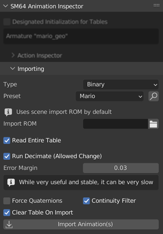

Animations 2.4.0+
=================

Importing existing animations
------------------------------

From Binary
~~~~~~~~~~~

First, you must acquire an extended ROM (unless you only intend on importing Mario's animations which are uncompressed).
For this, you can use `ROM Manager <https://pilzinsel64.de/sm64-rom-manager/>`_ or alternatively `sm64Extend <https://smwc.me/s/20095>`_.

Enable "Show Importing Menus" in the panel "SM64 General Settings". Then set the Import Rom path to your extended ROM.

.. image:: ../showing_importing_menus.png
    :alt: "Show Importing Menus" toggle highlighted in the panel "SM64 General Settings"

`Import your desired model's rig <https://github.com/Fast-64/fast64/blob/main/fast64_internal/sm64/README.md#importingexporting-sm64-geolayouts>`_ or, for Mario, use the `example Mario model <https://github.com/Lilaa3/fast64-models/tree/mario-examples/mario>`_.

Select the "Binary" type and select a preset, for custom presets see `this <#custom-import-preset-binary>`_.

Custom Import Preset (Binary)
~~~~~~~~~~~~~~~~~~~~~~~~~~~~~

**Type**
    - DMA
    - Table
    - Animation

**Ignore Bone Count**
    Ignore the bone count of the target armature, necesary for when headers have a different bone count than the target armature.