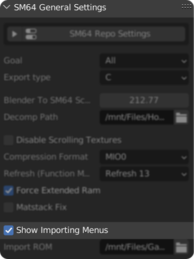

Animations 2.4.0+
=================

Importing existing animations
-----------------------------
| To import animations, you will need a rig.
    `Read this to import your desired model's rig <https://github.com/Fast-64/fast64/blob/main/fast64_internal/sm64/README.md#importingexporting-sm64-geolayouts>`_ 
    or, for Mario, use the `example Mario model <https://github.com/Fast64/fast64-models/tree/mario-examples/mario>`_.
| Make sure to enable ``Show Importing Menus`` in the panel ``SM64 General Settings``.

~~~~~~~~~~~~~~~~~~~~~~~~~~~~~~~~~~~~~~~~~~~~~~~~~~~~~~~~~~~~~~~~~~~~~~

After that you can find the sub-panel ``Importing`` under ``SM64 Animation Inspector``.

Then follow your respective import goal:
    - `Binary <#importing-existing-animations-binary>`_
    - `C <#importing-existing-animations-c>`_

Importing existing animations (C)
---------------------------------
| Select the ``C`` type and select a preset using the search button next to it, for custom presets simply select a folder or file,
    otherwise set the decomp path in the animation importer or the general settings.
| Enable ``Use Custom Name`` if you need the original names.
| See `General Import Settings`_ for info on the rest of the settings.

Importing existing animations (Binary)
--------------------------------------

Setting up the ROM
~~~~~~~~~~~~~~~~~~
.. include:: ../enable_importing_binary.rst
~~~~~~~~~~~~~~~~~~~~~~~~~~~~~~~~~~~~~~~~~~~

How to use the importer
~~~~~~~~~~~~~~~~~~~~~~~

Select the ``Binary`` type and select a preset using the search button next to it, 
keep reading to learn how to use custom presets, otherwise skip to `General Import Settings`_ for info on the rest of the settings.

Custom Import Preset
~~~~~~~~~~~~~~~~~~~~
**Types**
    - ``DMA``: Import from a DMA table (Mario), you will need to set the ``DMA Table Address`` to the address in ROM.
    - ``Table``: Import from a table, you will need to enable/disable ``Is Segmented Address`` and set the address of the table, 
      set ``Level`` to a level where the table is loaded, enable ``Check NULL Delimiter`` if the table's last element is a NULL (0x00)
      otherwise set ``Size`` to the amount of elements if you have ``Read Entire Table`` enabled, if you aren´t reading the entire table
      you need to set the ``Index``.
    - ``Animation``: Import a single animation, you will need to enable/disable ``Is Segmented Address``, set the address of the animation header 
      and set ``Level`` to a level where the animation is loaded.

Enable ``Ignore Bone Count`` to ignore the bone count of the target armature, 
this is necesary for when headers have a different bone count than the target armature (Like the Amp).

Import Preset Settings
~~~~~~~~~~~~~~~~~~~~~~

| To import the entire table, enable ``Read Entire Table`` (on by default).
| To import a single animation, disable it and then either select one of the preset animations using the search button or 
    select ``Custom`` and choose an index.

General Import Settings
~~~~~~~~~~~~~~~~~~~~~~~

| The built-in animation f-curve decimate operator can be used to automatically clean up animations on import. 
    Enable ``Run Decimate (Allowed Change)`` (on by default) to use it.
| This is recommended for the ease of editing animations. The default error margin should keep the animation visually intact.
| **Be warned** this can be a bit slow.

| Enable ``Force Quaternions`` if you have no existing actions in the armature, 
    this sets all the animated bones in the armature to the quaternion rotation mode, which prevents gimbal lock.
| Alternatively, enable ``Continuity Filter`` (on by default) to at least fix any existing gimbal lock in the animations

Enable ``Clear Table On Import`` (on by default) to clear the table elements of the armature on import.

Finally, select your armature and click ``Import Animation(s)``.