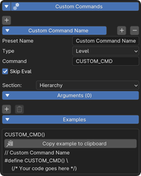
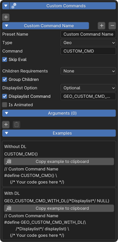

Custom Commands (2.5.0+)
========================

| Custom commands are way to define custom macros for level scripts, geolayouts and "special" collision.
| They can inherit basic properties of their owners (E.g. level empties can inherit all transforms, bones can inherit geometry, transforms (excluding scale) and layers).
| They can be exported in either binary or C.

Using custom commands
---------------------

| You can use custom commands in object empties and bones by selecting **Custom**.

.. list-table::
   :widths: 50 50
   :header-rows: 0
   :align: center

   * - .. image:: empty_no_preset.png
     - .. image:: empty_no_preset_bone.png

| You can then select a preset, or use the default No Preset mode.
| See `Adding new custom command presets`_ or skip to `Configuration`_.

Adding new custom command presets
---------------------------------

| You can create reusable commands that can be applied across multiple objects or bones.
| To do this, go into the SM64 tab, in **SM64 General Settings**, press the add button under **Custom Commands**.
| See `Configuration`_.
| These will be saved with :doc:`Repo Settings <../../common/repo_settings/repo_settings>`!

.. list-table::
   :widths: 33 33 34
   :header-rows: 0
   :align: center

   * - .. image:: empty_preset_edit_geo.png
     - .. image:: empty_preset_edit_level.png
     - .. image:: empty_preset_edit_special.png

Configuration
-------------
Some settings are only available when creating presets.

.. _command-name:

**Name**: *(Exclusive to presets)*
    The name of the preset that will show up in the dropdowns

.. _command-type:

**Type**:
    - *Level*: Commands for level scripts, shows up in empties.
    - *Geo*: Commands for geometry layouts, shows up in empties and bones
    - *Collision*: Commands for collision data (Special, sometimes used for warps and a few objects), shows up in empties

.. _command:

**Command**::
    The macro name or numeric ID of the command

.. _skip-eval:

**Skip Eval**:
   When enabled, skips expression evaluation outside of binary mode

Level
~~~~~

.. raw:: html

    

.. _section:

**Section**: (Exclusive to presets, always **Hierarchy** without a preset)

- .. _section-hierarchy:

  *Hierarchy*: Adds before areas if parented to level, otherwise in respective area

- .. _section-area:

  *Area*: Adds to area (errors if parented to level)

- .. _section-level:

  *Level*: Adds to level (errors if parented to area)

- .. _section-force-level:

  *Force to Level*: Forces addition to level even if parented to area

Geolayout Presets
~~~~~~~~~~~~~~~~~

.. raw:: html

    

.. _children-requirements:

**Children Requirements**: *(Exclusive to presets)*

- .. _children-requirements-none:

  *None*: No requirements for child nodes, can optionally have children

- .. _children-requirements-must-have:

  *Must Have Children*: Requires at least one child node, errors otherwise (like ``GEO_SWITCH``)

- .. _children-requirements-no-children:

  *No Children*: Errors if node has children nodes (like ``GEO_ASM``)

.. _children-requirements-children:

**Group Children**:
    Use ``GEO_OPEN_NODE``/``GEO_CLOSE_NODE`` to group child nodes

.. _displaylist-option:

**Displaylist Option**:

- .. _displaylist-option-none:

  *None*: Doesn´t inherit geometry, deform disabled for bones

- .. _displaylist-option-optional:

  *Optional*: Can inherit geometry, if no geometry can be inherited it uses ``NULL`` or the :ref:`Displaylist Command <displaylist-command>`.

- .. _displaylist-option-required:

  *Required*: Must inherit geometry or export will fail

.. _displaylist-command:

**Displaylist Command**: (Exclusive to :ref:`Displaylist Option being set to Optional <displaylist-option>`)
    | Command to use when geometry can be inherted. Will add an extra displaylist argument at the end.
    | This is seen in vanilla with for E.g. ``GEO_TRANSLATE_NODE``, with the displaylist variant is ``GEO_TRANSLATE_NODE_WITH_DL`` (under the hood these use the same ID)

.. _is-animated:

**Is Animated**
    Include animation data on animation export

Arguments
~~~~~~~~~

| Arguments define the parameters your custom command will include.
| In presets you can set a name to show up, the toggle the left side of the name will enable or disable visibility in the UI but still be appended to the command.
| To create a new argument, press the plus button.

.. _`expression`:

**Expression**: (Binary or with "Skip Eval" disabled)
    Defines a basic python expression that will run on the final values being passed. Pre generated examples will not take these into accounts

    .. note::
        The expressions are limited in functionality to prevent abuse, as custom commands get loaded automatically from repo settings.

    Example:

    .. image:: eval_example.png
        :align: left

    We are taking the final RGBA color in base 1, isolating RGB, scaling each value to 0-255 and rounding.

    .. raw:: html

        

    Supported builtin python functions: 
        ``round``, ``abs``, ``len``, ``min``, ``max``, ``sum``, ``sorted``, ``all``, ``any``, ``enumerate``, ``tuple``, ``list``, ``set``, ``dict``, ``range``

    Additional functions:
        * ``flatten(x)``: 
            | Flattens a nested list/tuple into a single tuple. 
            | ``flatten([1, 2, [3, 4]])`` -> ``[1, 2, 3, 4]``
        * ``cast_integer(value, bit_count, signed)``: 
            Clamps an integer to the valid range of a specific bit count and signness.

            .. math::
                Min =
                \begin{cases}
                    -(2^{\text{bit_count} - \text{signed}}) & \text{if signed} \\
                    0 & \text{if not signed}
                \end{cases}

            .. math::
                Max = 2^{\text{bit_count - signed}} - signed

.. _binary-types:

**Export Types**: *(Exclusive to binary)*
    | Bellow the eval expression, an option for the final types is available. Each argument type has its own appropriate default type.
    | These are standard 64 bit types, as in, int is 32 bit, long is 64 bit, float is 32 bit and double is 64 bit.

    .. image:: binary_type.png

.. _common-options:

**Common Options**:

    - **Use Relative Transformation**: 
        Use the local (relative to parent) transformation instead of the world transformation
    - **Blender to SM64 Scale**: 
        Multiply by Blender to SM64 scale value
    - **Inherit**: 
        Inherit values from owner, like transformations or geometry.

.. _argument-types:

.. list-table:: Types

   * - .. image:: parameter.png
         :class: no-shrink
     - **Parameter**

       Basic string, binary will try to evaluate this

   * - .. image:: boolean.png
         :class: no-shrink
     - **Boolean**

       True/false

   * - .. image:: number.png
         :class: no-shrink
     - **Number**

       - *Is Integer*: Whole numbers
       - *Min/Max* (Preset Only): Value limits
       - *Step* (Preset Only): Increment/decrement amount

   * - .. image:: color.png
         :class: no-shrink
     - **Color**

       Base 1 RGBA color

       - **Round to Conventional Units**: 

            | Uses singular argument, each value corresponds to the bit count of R, G, B, A. 
            | If 0 the element is removed.

   * - .. image:: enum.png
         :class: no-shrink
     - **Enum**

       Dropdown selection of user defined options

   * - .. image:: translation.png
         :class: no-shrink
     - **Translation**

       - **Round to Conventional Units**: 

            Rounds to signed 16-bit

   * - .. image:: rotation.png
         :class: no-shrink
     - **Rotation**

        - **Rotation Type**:

            - *Euler*: Euler rotation in degrees
            - *Quaternion*: Quaternion representation
            - *Axis Angle*: Axis and angle representation

        - **Rotation Order**:

            | Order to convert to.
            | ZYX is the default for level objects, XYZ is the default for geolayout commands.

   * - .. image:: scale.png
         :class: no-shrink
     - **Scale**

       Not available in bones

       - **Round to Conventional Units**:

            Rounds to x * ``0x10000``

   * - .. image:: matrix.png
         :class: no-shrink
     - **Matrix**

       4x4 transformation matrix

   * - .. image:: layer.png
         :class: no-shrink
     - **Layer**

       If geometry can be inherited this is overridden

   * - .. image:: displaylist.png
         :class: no-shrink
     - **Displaylist**

        - **Encode to Segmented Address**: (Binary only)
            Encode address with the segment of the export level's segment
